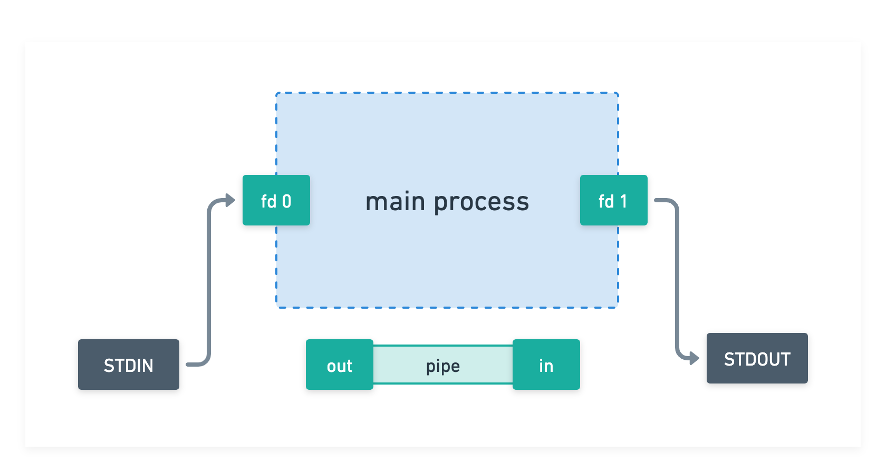
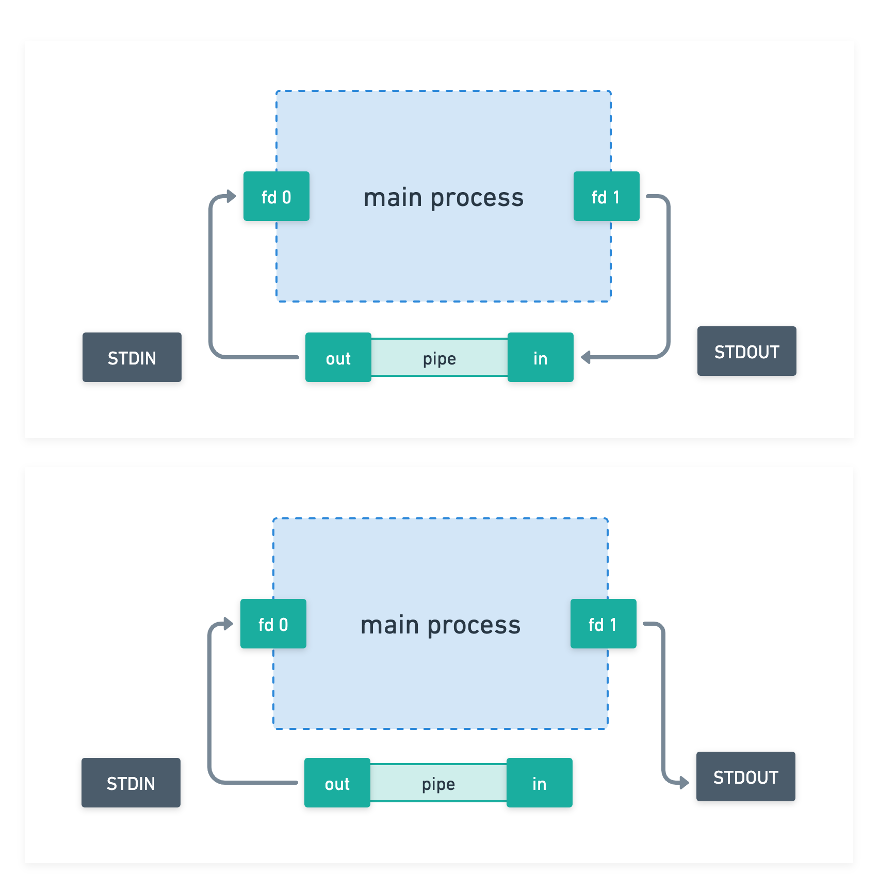

## Team Pakchoi 🥬

- [cpak](https://github.com/PCHANUL)
- [sarchoi](https://github.com/srngch)

[](https://42seoul.kr/)
[![result](https://img.shields.io/badge/WIP-0/100-5cb85c?style=flat-square&logoWidth=12&logo=)](https://projects.intra.42.fr/42cursus-minishell/sarchoi)


[](https://github.com/42pakchoi/minishell)
[](https://github.com/42pakchoi/minishell)

<details>
  <summary>Table of Contents</summary>
  <ol>
    <li><a href="#requirements">Requirements</a></li>
    <li><a href="#implementation">Implementation</a></li>
    <li><a href="#project-structure">Project Structure</a></li>
    <li><a href="#environment">Environment</a></li>
    <li><a href="#compile">Compile</a></li>
		<li><a href="#execute">Execute</a></li>
		<li><a href="#example">Example</a></li>
		<li><a href="#test">Test</a></li>
		<li><a href="#links">Links</a></li>
  </ol>
</details>

---

# Minishell

The objective of this project is for you to create a simple shell. Yes, your own little bash or zsh. You will learn a lot about processes and file descriptors.

## Requirements

|                      |                                           |
| -------------------- | ----------------------------------------- |
| **Program name**     | `minishell`                               |
| **Makefile**         | `all`, `clean`, `fclean`, `re`            |
| **Arguments**        | None                 |
| **External functs.** | `readline`, `rl_on_new_line`, `rl_replace_line`, `rl_redisplay`, `add_history`, `printf`, `malloc`, `free`, `write`, `open`, `read`, `close`, `fork`, `wait`, `waitpid`, `wait3`, `wait4`, `signal`, `kill`, `exit`, `getcwd`, `chdir`, `stat`, `lstat`, `fstat`, `unlink`, `execve`, `dup`, `dup2`, `pipe`, `opendir`, `readdir`, `closedir`, `strerror`, `errno`, `isatty`, `ttyname`, `ttyslot`, `ioctl`, `getenv`, `tcsetattr`, `tcgetattr`, `tgetent`, `tgetflag`, `tgetnum`, `tgetstr`, `tgoto`, `tputs` |
| **Libft authorized** | Yes                                       |

## Implementation

- prompt
- history
- builtins
	- `echo` with option `-n`
	- `cd` with only a relative or absolute path
	- `pwd` without options
	- `export` without options
	- `unset` without options
	- `env` without options or arguments
	- `exit` without options
- interpretation `"` only for `$`
- redirections
	- `<` redirect input
	- `>` redirect output
	- `<<` heredoc
	- `>>` redirect output with append mode
- pipes: `|`
- environment variables: `$`
- exit status: `$?`
- signal interactive like bash
	- `ctrl-c` print a new prompt on a newline.
	- `ctrl-d` exit the shell.
	- `ctrl-\` do nothing.

## Project Structure

```
./
├── includes/		# header files
├── libft/		# library files
├── src/		# source files
│   ├── builtin/	# builtin commands
│   └── util/		# utility functions
├── test/		# test command files
└── Makefile
```

## Environment

- MacOS 12.3.1(Monterey, Intel)

Developed and tested in this environment.

## Compile

### Mandatory

```bash
$ git clone https://github.com/42pakchoi/minishell
$ make
```

## Execute

Run compiled executable file in the root folder.

```bash
$ ./minishell
~/path_to_pwd/minishell $ 
```

## Example

```bash
# minishell builtin commands
~/path_to_pwd/minishell $ echo "Hello world!"
Hello world!
# commands in PATH
~/path_to_pwd/minishell $ ls
Makefile	includes	minishell	test
README.md	libft		src
# command `exit` or press `ctrl-d` to exit the minishell
~/path_to_pwd/minishell $ exit
```

## Test

### Test command

Test using files with multiple lines of command in `test` directory. Each line of the file is in the following format: `command >> result.txt`

```bash
$ bash -i < test.txt # run interactive mode bash with test file
$ mv result.txt result_bash.txt # change file name to keep result of bash
$ ./minishell < test.txt # run minishell with test file
$ diff result.txt result_bash.txt # compare result of bash and minishell
$ cat result.txt # show result if you want
```

### Check memory leak

```bash
$ leaks -atExit -- ./minishell
```

Runs leaks when the Minishell exits.

## Logics

### Flow Chart

#### Entire

```mermaid
graph LR
    e1([Start]) --> e2[initial]
    e2 --> e3[[Command Loop]]
    e3  --> e4[free]
    e4 --> e5([Exit])
```

#### Command Loop

```mermaid
graph TD
    start([Command Loop]) --> s1[update prompt string]
    s1 --> s2{"<code>deal_prompt()</code><br/>print prompt string<br/>receive input(readline)"}
    s2 -- string --> s3["<code>save_history()</code>"]
    s3 --> s4["<code>deal_command()</code><br/>parse input string<br/>run command<br/>if redir, set a pipe"]
    s4 --> s5["<code>remove_cmd_list()</code><br/>free t_cmd list"]
    s5 --> s6["<code>restore_ori_stdin()</code><br/>if redir, restore pipe"]
    s6 --> s7[free input string<br/>that was allocated<br/>from readline]
    s7 --> s2
    s2 -- "eof<br/>(ctrl-d)" ------> return
    return([return])
```

### Steps to parse input

1. String `char *g_mini.prompt_input` is allocated from `readline`
	```c
	"echo hello $USER | cat -e > out.txt" // g_mini.prompt_input
	```
2. `g_mini.prompt_input` is split by a operator(`>`, `>>`, `<`, `<<`, `|`), into string array `char **arr`
	```c
	"echo hello $USER" // arr[0]
	"cat -e" // arr[1]
	"out.txt" // arr[2]
	```
3. Elements of `arr` is split by white space into a string array `char **strarr`
	```c
	"echo" // strarr[0] 
	"hello" // strarr[1] 
	"$USER" // strarr[2] 
	```
4. Translate environment variables name to value if `$` is found in the element of `strarr`
	```c
	"echo" // strarr[0] 
	"hello" // strarr[1] 
	"pakchoi" // strarr[2] 
	```
5. Keep `strarr` and a operator data in `t_cmd` structure and add it to the list `t_cmd *g_mini.cmd`

### Priority of command execution

1. `exec_assign()`: If string is input in the form `name=[value]`, assign it as a environment variable
2. `exec_builtin()`: If the command is builtin command of minishell, then run it
3. `exec_execve()`: If the command is not builtin command, then run it with `execve()`

### File Descriptor and pipe

#### The default setting of STDIN and STDOUT



#### Pipe to execute a command with $PATH


- `loop 1-1`: The child process to execute the command is forked. At this moment, the STDIN and STDOUT setting of the child process are the same as the main process.
- `loop 1-2`: A pipe is used to keep the result of the child process. The output of the child process and the in of the pipe are connected.
- `loop 1-3`:The child process executes the command program and then terminates. The result is sent to the connected pipe.
- `loop 1-4`: The out of the pipe and the input of the main process are connected.
- `loop 2-1`: The loop is repeated if there is a command thereafter. From the second iteration, the input received from the previous child process is used instead of the STDIN.
- And it repeats like loop 1...

#### Pipe to assign env var and to execute a builtin command



- In order to assign environmental variables or to execute a builtin command, it is not necessary to fork the process. A pipe is used to receive the result of STDOUT as its own STDIN. If there is a command to be executed next, it will look at this STDIN.
- Restore to default STDOUT for printing on the terminal.

## Links

- [Subject - 42 Intra](https://projects.intra.42.fr/projects/42cursus-minishell)
- [Subject - 42Seoul Translation](https://github.com/42seoul-translation/subject_ko/blob/master/minishell/minishell.md)
- [GNU Bash manual](https://www.gnu.org/savannah-checkouts/gnu/bash/manual/)
